```r
knitr::opts_knit$set(root.dir = 'D:/Projects/Ad_click')
```


##library


```r
library(lubridate)
```

```
## Warning: package 'lubridate' was built under R version 4.1.2
```

```
## 
## Attaching package: 'lubridate'
```

```
## The following objects are masked from 'package:base':
## 
##     date, intersect, setdiff, union
```

```r
library(dplyr)
```

```
## 
## Attaching package: 'dplyr'
```

```
## The following objects are masked from 'package:stats':
## 
##     filter, lag
```

```
## The following objects are masked from 'package:base':
## 
##     intersect, setdiff, setequal, union
```

```r
library(forecast)
```

```
## Warning: package 'forecast' was built under R version 4.1.2
```

```
## Registered S3 method overwritten by 'quantmod':
##   method            from
##   as.zoo.data.frame zoo
```

```r
library(caret)
```

```
## Warning: package 'caret' was built under R version 4.1.2
```

```
## Loading required package: ggplot2
```

```
## Loading required package: lattice
```

```r
library(rpart)
```

```
## Warning: package 'rpart' was built under R version 4.1.2
```

```r
library(rpart.plot)
```

```
## Warning: package 'rpart.plot' was built under R version 4.1.2
```
#load the datset


```r
ad.df<- read.csv("D:/TBANLT 560/Final_Exam/advertising.csv")
```
## Data pre-processing


```r
ad.df <- ad.df %>% mutate(Timestamp = mdy_hm(`Timestamp`))
ad.df<-ad.df %>%
  dplyr::mutate(month = lubridate::month(Timestamp), 
                day = lubridate::day(Timestamp),
                dayofweek= lubridate::wday(Timestamp, week_start = 1))
```


## Check for Imbalance of dependant data-- We have equal number yes/no


```r
barplot(prop.table(table(ad.df$Clicked.on.Ad)),
        col = rainbow(2),
        main = "Class Distribution")
```

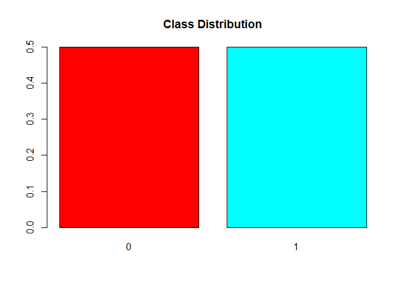<!-- -->


## Exploratory Data  Analysis

## Summary Statistics

```r
summary(ad.df)
```

```
##  Daily.Time.Spent.on.Site      Age         Area.Income    Daily.Internet.Usage
##  Min.   :32.60            Min.   :19.00   Min.   :13996   Min.   :104.8       
##  1st Qu.:51.36            1st Qu.:29.00   1st Qu.:47032   1st Qu.:138.8       
##  Median :68.22            Median :35.00   Median :57012   Median :183.1       
##  Mean   :65.00            Mean   :36.01   Mean   :55000   Mean   :180.0       
##  3rd Qu.:78.55            3rd Qu.:42.00   3rd Qu.:65471   3rd Qu.:218.8       
##  Max.   :91.43            Max.   :61.00   Max.   :79485   Max.   :270.0       
##  Ad.Topic.Line          City                Male         Country         
##  Length:1000        Length:1000        Min.   :0.000   Length:1000       
##  Class :character   Class :character   1st Qu.:0.000   Class :character  
##  Mode  :character   Mode  :character   Median :0.000   Mode  :character  
##                                        Mean   :0.481                     
##                                        3rd Qu.:1.000                     
##                                        Max.   :1.000                     
##    Timestamp                   Clicked.on.Ad     month            day       
##  Min.   :2016-01-01 02:52:00   Min.   :0.0   Min.   :1.000   Min.   : 1.00  
##  1st Qu.:2016-02-18 02:55:15   1st Qu.:0.0   1st Qu.:2.000   1st Qu.: 8.00  
##  Median :2016-04-07 17:27:00   Median :0.5   Median :4.000   Median :15.00  
##  Mean   :2016-04-10 10:33:36   Mean   :0.5   Mean   :3.817   Mean   :15.48  
##  3rd Qu.:2016-05-31 03:18:00   3rd Qu.:1.0   3rd Qu.:5.000   3rd Qu.:23.00  
##  Max.   :2016-07-24 00:22:00   Max.   :1.0   Max.   :7.000   Max.   :31.00  
##    dayofweek    
##  Min.   :1.000  
##  1st Qu.:2.000  
##  Median :4.000  
##  Mean   :4.064  
##  3rd Qu.:6.000  
##  Max.   :7.000
```


##What age group does the dataset majorly consist of?


```r
ggplot(data=ad.df,aes(x=Age))+
  geom_histogram(aes(x =Age),
                 bins=20,
                 color="black", 
                 fill="dodgerblue") +
  labs(title="Histogram for Age group",
         x= "Age")+
  geom_density(col=3)
```

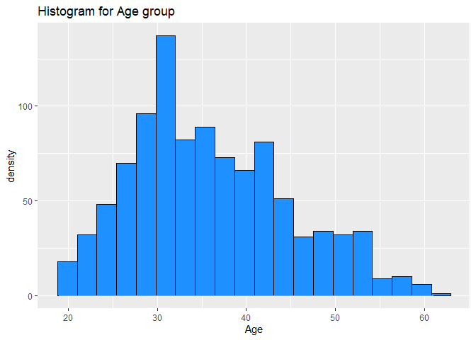<!-- -->


### Income distribution for different age groups , clicked on Ad


```r
ad.df$Clicked.on.Ad <- as.factor(ad.df$Clicked.on.Ad)
ggplot(ad.df, aes(x = Age, y =Area.Income, colour = Clicked.on.Ad))+ 
  geom_point(size=2.5)
```

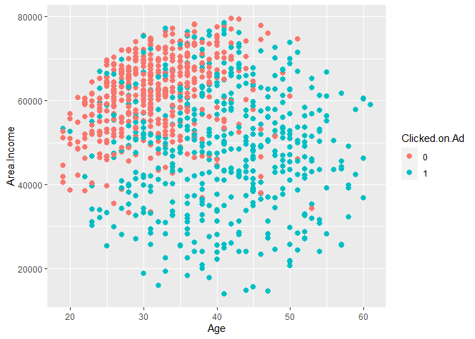<!-- -->

### Which age group is spending maximum time on the internet? and who clicked on Ad?


```r
ggplot(ad.df, aes(x = Age, y =Daily.Internet.Usage, colour = Clicked.on.Ad))+ 
  geom_point(size=2) +  scale_color_brewer(palette = "Set1")
```

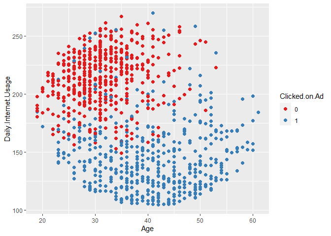<!-- -->

```r
##scale_color_grey(start = 0.8, end = 0.2)
#scale_color_manual(values = c("A" = "green", "B" = "red"))
```


### Ad click based on gender


```r
ggplot(ad.df, 
       aes(x = Male, 
           fill = Clicked.on.Ad)) + 
  geom_bar(position = "dodge")
```

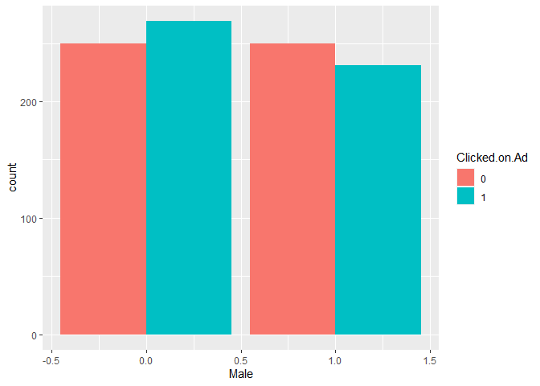<!-- -->


### Visualizing Ad clicked on different time stamps


```r
cdplot(as.factor(Clicked.on.Ad) ~ month , data=ad.df)
```

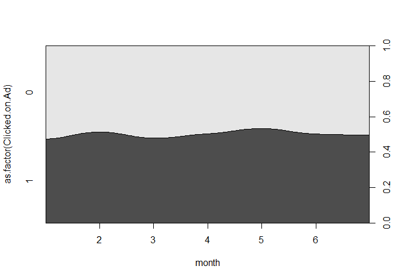<!-- -->

```r
cdplot(as.factor(Clicked.on.Ad) ~ day , data=ad.df)
```

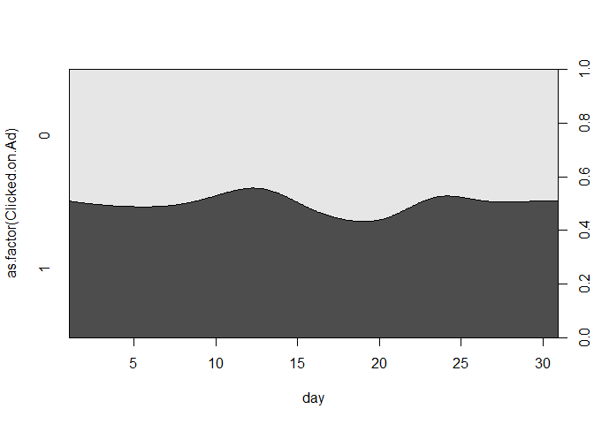<!-- -->

```r
cdplot(as.factor(Clicked.on.Ad) ~ dayofweek , data=ad.df)
```

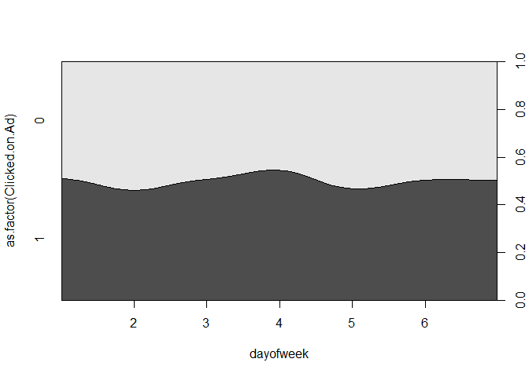<!-- -->

## Check for correlation


```r
library(corrplot)
```

```
## Warning: package 'corrplot' was built under R version 4.1.2
```

```
## corrplot 0.92 loaded
```

```r
M<-cor(ad.df[, unlist(lapply(ad.df, is.numeric))],method="pearson")
M
```

```
##                          Daily.Time.Spent.on.Site         Age  Area.Income
## Daily.Time.Spent.on.Site               1.00000000 -0.33151334  0.310954413
## Age                                   -0.33151334  1.00000000 -0.182604955
## Area.Income                            0.31095441 -0.18260496  1.000000000
## Daily.Internet.Usage                   0.51865848 -0.36720856  0.337495533
## Male                                  -0.01895085 -0.02104406  0.001322359
## month                                 -0.01091956  0.02368925 -0.050216130
## day                                   -0.01121736 -0.03816163 -0.026523412
## dayofweek                              0.01833562  0.01359304  0.013878690
##                          Daily.Internet.Usage         Male        month
## Daily.Time.Spent.on.Site          0.518658475 -0.018950855 -0.010919562
## Age                              -0.367208560 -0.021044064  0.023689247
## Area.Income                       0.337495533  0.001322359 -0.050216130
## Daily.Internet.Usage              1.000000000  0.028012326  0.017529853
## Male                              0.028012326  1.000000000  0.005219737
## month                             0.017529853  0.005219737  1.000000000
## day                              -0.012530762 -0.013252632 -0.017273510
## dayofweek                         0.009035301 -0.038861106 -0.020089657
##                                  day    dayofweek
## Daily.Time.Spent.on.Site -0.01121736  0.018335621
## Age                      -0.03816163  0.013593035
## Area.Income              -0.02652341  0.013878690
## Daily.Internet.Usage     -0.01253076  0.009035301
## Male                     -0.01325263 -0.038861106
## month                    -0.01727351 -0.020089657
## day                       1.00000000  0.041234678
## dayofweek                 0.04123468  1.000000000
```

```r
corrplot(M,method="circle")
```

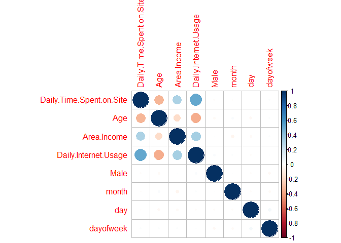<!-- -->
## Machine Learning Models

## Removing the variables ad topic, city,country,Timestamp  which is of not gretaer importance to model


```r
ad.df<-select (ad.df,-c(Ad.Topic.Line,City,Country,Timestamp))
```


## Split the dataset into train and test


```r
set.seed(1) # Set the seed for the  random number generator for reproducing the
# partition.
train.index <- sample(c(1:dim(ad.df)[1]), dim(ad.df)[1]*0.7)
test.index <- setdiff(c(1:dim(ad.df)[1]), train.index)
train.df <- ad.df[train.index, ]
test.df <- ad.df[test.index, ]
```


### Using Logistic regression buid the model


```r
lm.fit <- glm(Clicked.on.Ad ~., data = train.df, family = "binomial")
summary(lm.fit)
```

```
## 
## Call:
## glm(formula = Clicked.on.Ad ~ ., family = "binomial", data = train.df)
## 
## Deviance Residuals: 
##     Min       1Q   Median       3Q      Max  
## -1.9389  -0.1213  -0.0445   0.0112   3.2375  
## 
## Coefficients:
##                            Estimate Std. Error z value Pr(>|z|)    
## (Intercept)               2.949e+01  3.725e+00   7.917 2.44e-15 ***
## Daily.Time.Spent.on.Site -2.035e-01  2.760e-02  -7.375 1.65e-13 ***
## Age                       1.833e-01  3.352e-02   5.468 4.54e-08 ***
## Area.Income              -1.589e-04  2.597e-05  -6.117 9.53e-10 ***
## Daily.Internet.Usage     -6.875e-02  9.182e-03  -7.488 7.00e-14 ***
## Male                     -4.589e-01  5.172e-01  -0.887   0.3749    
## month                    -2.144e-02  1.349e-01  -0.159   0.8737    
## day                      -2.178e-02  3.066e-02  -0.710   0.4775    
## dayofweek                 2.446e-01  1.301e-01   1.880   0.0601 .  
## ---
## Signif. codes:  0 '***' 0.001 '**' 0.01 '*' 0.05 '.' 0.1 ' ' 1
## 
## (Dispersion parameter for binomial family taken to be 1)
## 
##     Null deviance: 970.31  on 699  degrees of freedom
## Residual deviance: 113.45  on 691  degrees of freedom
## AIC: 131.45
## 
## Number of Fisher Scoring iterations: 8
```

### Predicting the model using test dataset


```r
# evaluate
predictlm <- predict(lm.fit, test.df)

predictlm<-ifelse(predictlm > 0.5, 1, 0)
```


### Evaluate the model Accuracy


```r
library(caret)
cmt1<-confusionMatrix(as.factor(predictlm),as.factor(test.df$Clicked.on.Ad))
cmt1
```

```
## Confusion Matrix and Statistics
## 
##           Reference
## Prediction   0   1
##          0 142   6
##          1   4 148
##                                           
##                Accuracy : 0.9667          
##                  95% CI : (0.9396, 0.9839)
##     No Information Rate : 0.5133          
##     P-Value [Acc > NIR] : <2e-16          
##                                           
##                   Kappa : 0.9333          
##                                           
##  Mcnemar's Test P-Value : 0.7518          
##                                           
##             Sensitivity : 0.9726          
##             Specificity : 0.9610          
##          Pos Pred Value : 0.9595          
##          Neg Pred Value : 0.9737          
##              Prevalence : 0.4867          
##          Detection Rate : 0.4733          
##    Detection Prevalence : 0.4933          
##       Balanced Accuracy : 0.9668          
##                                           
##        'Positive' Class : 0               
## 
```


### Naive bayes


```r
library(e1071)
ad.nb <- naiveBayes(Clicked.on.Ad ~ ., data = train.df)
ad.nb
```

```
## 
## Naive Bayes Classifier for Discrete Predictors
## 
## Call:
## naiveBayes.default(x = X, y = Y, laplace = laplace)
## 
## A-priori probabilities:
## Y
##         0         1 
## 0.5057143 0.4942857 
## 
## Conditional probabilities:
##    Daily.Time.Spent.on.Site
## Y       [,1]      [,2]
##   0 76.83921  7.674939
##   1 53.49616 12.804357
## 
##    Age
## Y       [,1]     [,2]
##   0 31.97740 6.213350
##   1 40.72832 9.074964
## 
##    Area.Income
## Y       [,1]      [,2]
##   0 61463.48  8841.441
##   1 48180.64 13762.518
## 
##    Daily.Internet.Usage
## Y       [,1]     [,2]
##   0 215.6891 23.79666
##   1 144.5125 29.79292
## 
##    Male
## Y        [,1]      [,2]
##   0 0.4887006 0.5005798
##   1 0.4450867 0.4976951
## 
##    month
## Y       [,1]     [,2]
##   0 3.703390 1.948237
##   1 3.815029 1.903591
## 
##    day
## Y       [,1]     [,2]
##   0 15.81921 8.750950
##   1 15.17341 8.522365
## 
##    dayofweek
## Y       [,1]     [,2]
##   0 4.107345 1.997109
##   1 4.020231 2.002070
```

## Predicting the model using test dataset
 

```r
predict_nb<- predict(ad.nb, newdata = test.df)
cm2<-confusionMatrix(as.factor(predict_nb), as.factor(test.df$Clicked.on.Ad))
cm2
```

```
## Confusion Matrix and Statistics
## 
##           Reference
## Prediction   0   1
##          0 140   5
##          1   6 149
##                                           
##                Accuracy : 0.9633          
##                  95% CI : (0.9353, 0.9816)
##     No Information Rate : 0.5133          
##     P-Value [Acc > NIR] : <2e-16          
##                                           
##                   Kappa : 0.9266          
##                                           
##  Mcnemar's Test P-Value : 1               
##                                           
##             Sensitivity : 0.9589          
##             Specificity : 0.9675          
##          Pos Pred Value : 0.9655          
##          Neg Pred Value : 0.9613          
##              Prevalence : 0.4867          
##          Detection Rate : 0.4667          
##    Detection Prevalence : 0.4833          
##       Balanced Accuracy : 0.9632          
##                                           
##        'Positive' Class : 0               
## 
```

## Decision tree


```r
ad_dt <-rpart(Clicked.on.Ad ~ ., data = train.df)
prp(ad_dt, type = 1, extra = 1, split.font = 1, varlen =-10)
```

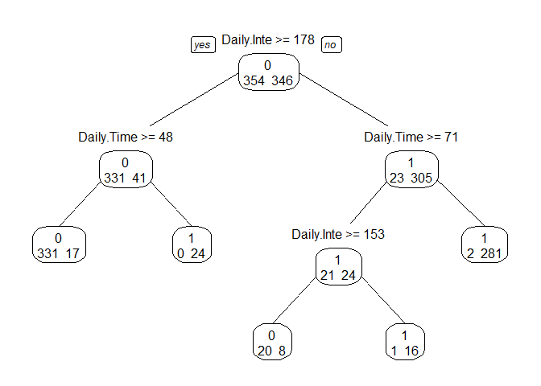<!-- -->


### Predicting the model using test dataset


```r
predict_dt<-predict(ad_dt,test.df,type="prob")
predict_dt <- ifelse(predict_dt>0.5,1,0)
predict_dt <- factor(colnames(predict_dt)[max.col(predict_dt)])
cm3 <-confusionMatrix(as.factor(predict_dt),as.factor(test.df$Clicked.on.Ad))
cm3
```

```
## Confusion Matrix and Statistics
## 
##           Reference
## Prediction   0   1
##          0 142  15
##          1   4 139
##                                           
##                Accuracy : 0.9367          
##                  95% CI : (0.9029, 0.9614)
##     No Information Rate : 0.5133          
##     P-Value [Acc > NIR] : < 2e-16         
##                                           
##                   Kappa : 0.8735          
##                                           
##  Mcnemar's Test P-Value : 0.02178         
##                                           
##             Sensitivity : 0.9726          
##             Specificity : 0.9026          
##          Pos Pred Value : 0.9045          
##          Neg Pred Value : 0.9720          
##              Prevalence : 0.4867          
##          Detection Rate : 0.4733          
##    Detection Prevalence : 0.5233          
##       Balanced Accuracy : 0.9376          
##                                           
##        'Positive' Class : 0               
## 
```

## Model comparison based on accuracy


```r
accuracy <- data.frame(round(cmt1$overall*100,3),round(cm2$overall*100,3),
                 round(cm3$overall*100,3))


names(accuracy) <- c("Logistic","NaiveBayes","DecisionTree")

model_compare <- data.frame(Model = c('Logistic',
                                      'NaiveBayes',
                                      'DecisionTree'
                                      ),
                            Accuracy = c(accuracy$Logistic[1],
                                         accuracy$NaiveBayes[1],
                                         accuracy$DecisionTree[1]
                                         ))

ggplot(aes(x=Model, y=Accuracy,fill=Model), data=model_compare) +
    geom_bar(stat='identity')  +
       geom_text(aes(label = Accuracy), size = 3,position=position_dodge(0.9))+
    ggtitle('Comparative Accuracy of Models on Cross-Validation Data') +
    xlab('Models') +
    ylab('Overall Accuracy')
```

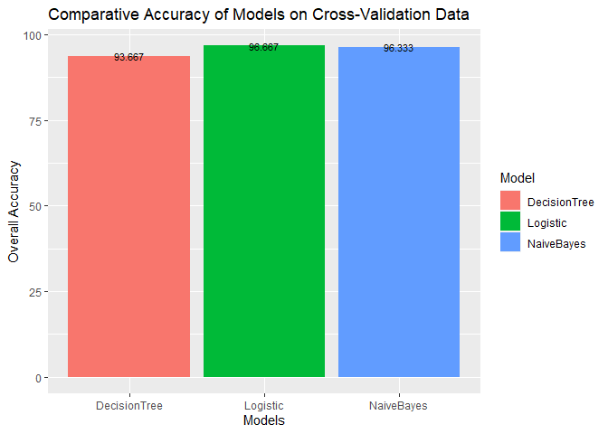<!-- -->


